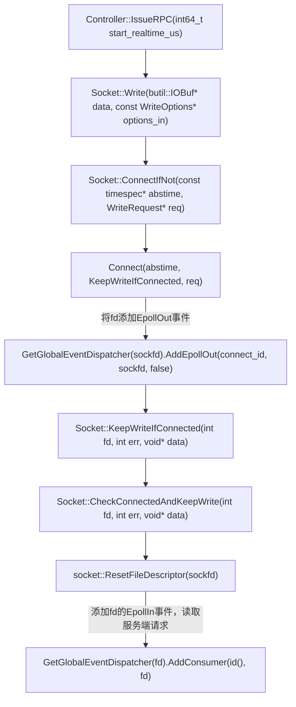

<!--
 * @Author: your name
 * @Date: 2021-01-25 22:14:53
 * @LastEditTime: 2021-01-25 22:58:37
 * @LastEditors: Please set LastEditors
 * @Description: In User Settings Edit
 * @FilePath: /learn/BRPC_learn/写入流程.md
-->
